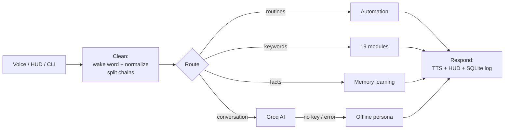
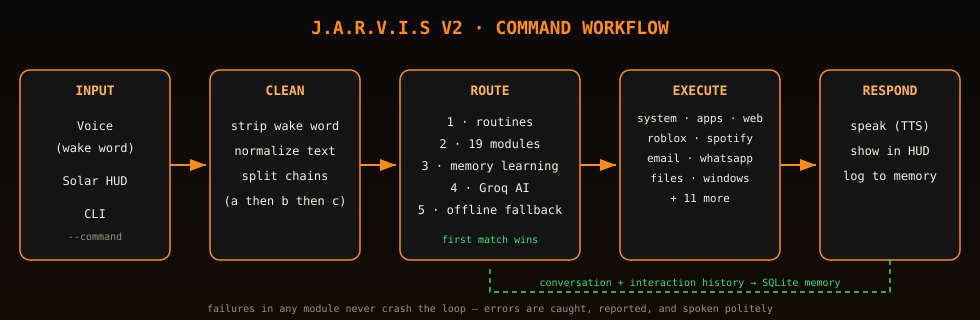
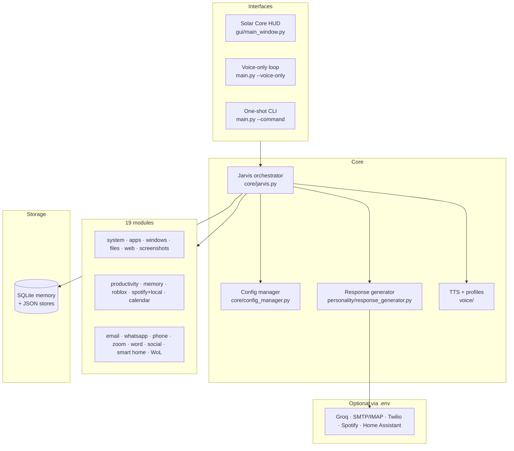
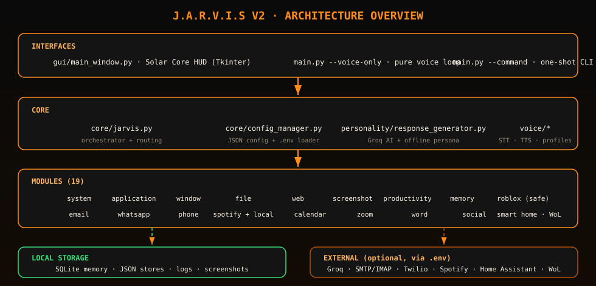

<div align="center">

# J.A.R.V.I.S V2

### All-in-One Desktop AI Assistant · Solar Core HUD

**Voice-first assistant with Groq AI, persistent memory, full desktop control,
and a cinematic black-and-orange holographic interface.**


*The Solar Core HUD — animated particle orbits, radial scan beams, live telemetry,
and the command console with SEND / SPEAK / ROBLOX / GRIND.*

</div>

---

## Table of contents

1. [Vision](#vision)
2. [Feature matrix](#feature-matrix)
3. [Solar Core HUD interface](#solar-core-hud-interface)
4. [Voice personas](#voice-personas)
5. [Command workflow](#command-workflow)
6. [Architecture](#architecture)
7. [Installation](#installation)
8. [Groq AI setup](#groq-ai-setup)
9. [Run modes](#run-modes)
10. [Command cookbook](#command-cookbook)
11. [Roblox safe mode](#roblox-safe-mode)
12. [Integrations](#integrations)
13. [Power control & Wake-on-LAN](#power-control--wake-on-lan)
14. [Security model](#security-model)
15. [Project structure](#project-structure)
16. [Testing](#testing)
17. [Roadmap](#roadmap)
18. [Honest limitations](#honest-limitations)
19. [Credits & license](#credits--license)

---

## Vision

> *"Sir, all systems are online."*

J.A.R.V.I.S V2 is a single, self-contained Python assistant that turns any desktop
into a Stark-style command center. Speak or type naturally — `hey jarvis, system
status`, `open chrome then volume 40`, `start a 30 minute roblox grind session` —
and Jarvis routes the request through 19 purpose-built modules, remembers what
matters in local SQLite, and answers with a configurable synthetic voice.

No cloud accounts required for the core experience: everything runs locally, and
the Groq AI layer simply makes the conversation unlimited when you add a key.

## Feature matrix

| Domain | Capabilities | Offline? |
| --- | --- | --- |
| 🎙️ Voice | Wake words, speech recognition, spoken responses, 4 voice personas | ✅ |
| 🧠 AI chat | Groq (Llama 3.3 70B) with conversation history + memory context | Key needed |
| 🧠 Memory | SQLite facts, preferences, name learning, conversation + interaction history | ✅ |
| 🖥️ System | CPU/memory/disk/battery telemetry, volume, mute, lock, sleep/restart/shutdown | ✅ |
| 🚀 Applications | Open/close/list apps by name with fuzzy matching | ✅ |
| 🪟 Windows | Maximize, minimize, snap left/right via hotkeys | ✅ |
| 📸 Screenshots | Timestamped captures with optional custom names | ✅ |
| 📁 Files | Open folders, create folders, search files | ✅ |
| 🌐 Web | Google search, site shortcuts, Wikipedia summaries, weather, news | ✅ |
| ⏰ Productivity | Notes, tasks, reminders, timers | ✅ |
| 😄 Fun | Jokes (pyjokes + built-in fallbacks), time/date, time-of-day greetings | ✅ |
| 🎵 Music | Spotify API control **with local `~/Music` library fallback** | ✅ |
| 🎮 Roblox | Grind sessions, goals, progress logs, official links, Robux safety guidance | ✅ |
| ✉️ Email | SMTP send, IMAP inbox, unread counts, latest subjects | Credentials |
| 💬 WhatsApp | Twilio sending with WhatsApp Web fallback | Credentials |
| 📞 Phone | `tel:` dialer handoff | ✅ |
| 📅 Calendar | Local event storage and schedule queries | ✅ |
| 🎥 Zoom | Join by meeting ID, mute/video hotkeys | ✅ |
| 📄 Word | Create/read/append documents (python-docx or text fallback) | ✅ |
| 🐦 Social | Tweet / LinkedIn post helpers | Credentials |
| 🏠 Smart home | Simulated devices, Home Assistant-ready structure | HA optional |
| ⚡ Wake-on-LAN | Wake sleeping PCs by MAC address | ✅ |
| 🔗 Automation | Command chains (`a then b`) and named routines | ✅ |

## Solar Core HUD interface

Run `python main.py` and the **Solar Core HUD** takes over — pure Tkinter, zero web
stack. Full guide in [`docs/UI.md`](docs/UI.md).

- **Animated solar core** — pulsing layered glow, four counter-rotating particle
  orbit rings, eight drifting radial scan beams
- **Top navigation** — `HOME / AI / DASHBOARD` with a live `AI GROQ · VOICE READY ·
  CORE ACTIVE` status readout
- **AI chat view** — color-coded transcript; every command runs on a background
  thread so the UI never freezes
- **Dashboard** — CPU/MEM/DISK bars with green→orange→red thresholds, quick actions,
  and the **Roblox safe-mode panel** showing live session state and goals
- **Console** — `SEND / SPEAK / ROBLOX / GRIND` buttons; GRIND is context-aware
  (starts a session when idle, reports stats when one is running)
- **Telemetry everywhere** — `CPU MEM DSK PWR` under the core, refreshed every 2 s

## Solar Web Dashboard (Spark-style)

Prefer a browser dashboard? `python main.py --web` serves a **glassmorphism
Spark-style control center** at `http://localhost:8765` — built with the Python
standard library only (no Flask, no npm):

- **Hero solar core** — the same particle-orbit animation ported to HTML canvas
- **Circular live gauges** — CPU / MEMORY / DISK with color thresholds, power line
- **AI console card** — full chat with Jarvis (same pipeline as HUD/CLI/voice)
- **Tasks · Notes · Memory Core cards** — live from local SQLite + JSON stores
- **Roblox safe-mode card** — session countdown, goals checklist, grind stats
- **Quick actions grid** and a fixed bottom command console (`SEND / SPEAK /
  ROBLOX / GRIND`)
- **Browser voice** — SPEAK button uses the Web Speech API; replies are spoken
  aloud with a deep synthetic profile (rate 0.92, pitch 0.55), TTS toggleable

Everything polls `/api/state` every 2 seconds; commands POST to `/api/command`.
Point a browser at it from any device on your network — the dashboard is the UI,
Jarvis is the engine.

## Voice personas

Personas live in [`voice/voice_profiles.py`](voice/voice_profiles.py) and are set
via `voice.voice_profile` in config:

| Profile | Character |
| --- | --- |
| `dark_synthetic` **(default)** | Slow, low, heavy, commanding — an original dark-synthetic villain-AI persona |
| `jarvis_classic` | Calm, polite, professional butler |
| `fast_operator` | Brisk mission-control pace |
| `gentle` | Softer, quieter late-night voice |

Profiles tune rate, volume, pitch, and preferred system voices (GB male voices are
preferred when installed). The final sound depends on your OS speech engines.
*The `dark_synthetic` persona is original — it is not a clone or impersonation of
any film character such as Ultron, though it aims for the same "heavy synthetic
overlord" energy.*

## Command workflow





## Architecture





## Installation

**Prerequisites:** Python 3.10+ (3.8+ works except for some type hints), microphone
and speakers for voice features.

```bash
git clone https://github.com/jonathansteve-cell/JarvisV2.git
cd JarvisV2

# create and activate a virtual environment
python -m venv .venv
# Windows:
.venv\Scripts\activate
# macOS/Linux:
source .venv/bin/activate

# install dependencies
pip install -r requirements.txt

# initialize runtime folders and .env
python setup.py --init
```

> **Windows audio note:** if `SpeechRecognition` cannot open the microphone, install
> `pip install pipwin && pipwin install pyaudio`.

## Groq AI setup

The assistant is fully usable offline. To unlock unlimited conversation:

1. Create a free API key at **console.groq.com**
2. Copy the template and add your key — **never commit this file**:

```bash
cp .env.example .env   # Windows: copy .env.example .env
```

```env
GROQ_API_KEY=your_real_groq_api_key
GROQ_MODEL=llama-3.3-70b-versatile
```

3. Test it:

```bash
python main.py --command "explain what you can do"
```

`.env` is already listed in `.gitignore` and is **excluded from every package and
commit**. If you ever paste a key into a chat or screenshot, revoke it at
console.groq.com immediately.

## Run modes

| Mode | Command | What happens |
| --- | --- | --- |
| **Solar HUD** (default) | `python main.py` | Full desktop interface + voice |
| **Web Dashboard** | `python main.py --web` | Spark-style browser dashboard at `localhost:8765` |
| **Voice only** | `python main.py --voice-only` | No window; pure microphone loop |
| **One command** | `python main.py --command "system status"` | Execute and print, then exit |

## Command cookbook

Wake words (`hey jarvis`, `jarvis`) are optional on all commands.

**AI & conversation**
```text
Hey Jarvis, explain Python decorators
Hey Jarvis, write a short email for my boss
Hey Jarvis, what can you do?
```

**Memory & learning**
```text
Hey Jarvis, my name is Tony
Hey Jarvis, remember favorite color is blue
Hey Jarvis, I prefer dark mode
Hey Jarvis, what do you remember?
Hey Jarvis, memory stats
```

**System control**
```text
Hey Jarvis, system status
Hey Jarvis, CPU status
Hey Jarvis, battery level
Hey Jarvis, volume 50
Hey Jarvis, mute audio
Hey Jarvis, lock screen
Hey Jarvis, sleep computer
```

**Applications & windows**
```text
Hey Jarvis, open Chrome
Hey Jarvis, open Visual Studio Code
Hey Jarvis, close notepad
Hey Jarvis, running apps
Hey Jarvis, maximize window
Hey Jarvis, snap window left
```

**Screenshots, files & folders**
```text
Hey Jarvis, take screenshot
Hey Jarvis, open desktop
Hey Jarvis, create folder called Projects
Hey Jarvis, find resume.pdf
```

**Web**
```text
Hey Jarvis, Google Python best practices
Hey Jarvis, open YouTube
Hey Jarvis, weather
Hey Jarvis, news
Hey Jarvis, Wikipedia Nikola Tesla
```

**Time, date & fun**
```text
Hey Jarvis, what time is it?
Hey Jarvis, what's the date today?
Hey Jarvis, tell me a joke
Hey Jarvis, change your name to Ultron Prime
```

**Music**
```text
Hey Jarvis, play music                     → local ~/Music library (or Spotify if configured)
Hey Jarvis, play music bohemian            → matching local track
Hey Jarvis, play song Bohemian Rhapsody    → Spotify search/play
Hey Jarvis, pause music
Hey Jarvis, next song
Hey Jarvis, now playing
```

**Productivity**
```text
Hey Jarvis, take note: buy batteries
Hey Jarvis, add task: finish report
Hey Jarvis, show tasks
Hey Jarvis, remind me to drink water in 30 minutes
Hey Jarvis, set timer for 5 minutes
```

**Email · WhatsApp · Phone · Zoom · Word · Social · Smart home**
```text
Hey Jarvis, send email to alex@example.com subject Hello body This is Jarvis
Hey Jarvis, check email
Hey Jarvis, send WhatsApp to +15551234567: I am on my way
Hey Jarvis, call +15551234567
Hey Jarvis, join Zoom meeting 123456789
Hey Jarvis, create document Project Plan
Hey Jarvis, add to document: Phase one is complete
Hey Jarvis, tweet: Building Jarvis V2 today
Hey Jarvis, turn on living room light
Hey Jarvis, set thermostat to 72
```

**Command chains & routines**
```text
Hey Jarvis, open Chrome then volume 40
Hey Jarvis, run morning routine
Hey Jarvis, run work mode
```

## Roblox safe mode

Jarvis includes a dedicated Roblox assistant (`modules/roblox_controller.py`) built
around **legitimate play only** — grind with discipline, not cheats:

```text
Hey Jarvis, open Roblox
Hey Jarvis, search Roblox game for anime tower defense
Hey Jarvis, start 30 minute roblox grind session for daily quests
Hey Jarvis, roblox grind status
Hey Jarvis, end grind session
Hey Jarvis, set roblox goal: finish the obby
Hey Jarvis, show roblox goals
Hey Jarvis, complete roblox goal finish the obby
Hey Jarvis, log roblox progress: completed daily quests
Hey Jarvis, roblox stats
Hey Jarvis, how do I get robux safely?
Hey Jarvis, open Robux page
Hey Jarvis, open Roblox Creator Hub
Hey Jarvis, open DevEx
```

Sessions run on a real countdown timer and are logged to `data/roblox.json` with
daily totals, focus goals, and lifetime stats. The HUD dashboard shows the live
session state.

**What Jarvis refuses, always:** exploits, injectors/executors, aimbots, wallhacks,
farming bots/macros, account stealing, and **Robux generators**. Ask for any of
these and Jarvis explains why they violate the Roblox Terms of Use and usually
steal accounts instead.

**The honest truth about Robux:** there is no legitimate generator. Robux come from
buying them on the official store, the Premium monthly stipend, selling clothing /
items / game passes you create, or earnings from your own experiences cashed out
through DevEx once eligible. Jarvis will happily track your grind — it cannot and
will not create Robux out of thin air.

## Integrations

| Integration | Env vars (in `.env`) | Without credentials |
| --- | --- | --- |
| Groq AI | `GROQ_API_KEY`, `GROQ_MODEL` | Offline persona answers |
| Email | `JARVIS_EMAIL_ADDRESS`, `JARVIS_EMAIL_APP_PASSWORD` | Feature disabled politely |
| WhatsApp | `TWILIO_ACCOUNT_SID`, `TWILIO_AUTH_TOKEN`, `TWILIO_WHATSAPP_FROM` | Opens WhatsApp Web |
| Spotify | `SPOTIFY_CLIENT_ID`, `SPOTIFY_CLIENT_SECRET` | **Local `~/Music` playback** + web search |
| Wake-on-LAN | `JARVIS_TARGET_PC_MAC`, `JARVIS_TARGET_PC_BROADCAST` | Feature disabled politely |
| Smart home | Home Assistant token (structure ready) | Simulated devices |
| Google Calendar | OAuth flow (not yet implemented) | Local event storage |

## Power control & Wake-on-LAN

`sleep computer`, `restart computer`, and `shutdown computer` are guarded by
`behavior.confirm_dangerous_actions` in config — Jarvis explains the safety rule
instead of acting impulsively. Set it to `false` only if you accept the risk.

```text
Hey Jarvis, wake computer
```

sends a Wake-on-LAN magic packet to `JARVIS_TARGET_PC_MAC`. **Physical reality
check:** software can never cold-boot a powered-off PC by itself. Wake-on-LAN works
only from sleep/hibernate with BIOS "Power on by PCI-E"/WoL enabled and a wired or
supported Wi-Fi NIC. Full power-off requires BIOS power-restore settings, a smart
plug, or Intel AMT/vPro.

## Security model

- Secrets live **only** in your local `.env` (git-ignored, excluded from packages)
- Dangerous power actions require explicit config opt-in
- `roblox.allow_web_open` and `behavior.allow_web_open` gate all browser opening
- Every module call is wrapped — one failing module never crashes the loop
- All local data stays in `data/`, `logs/`, `screenshots/`, `documents/`
- No telemetry, no phone-home, no accounts

## Project structure

```text
JarvisV2/
├── main.py                    # GUI / voice-only / CLI entry point
├── main_voice_only.py         # Voice-only shortcut
├── setup.py                   # python setup.py --init
├── requirements.txt           # Runtime dependencies
├── .env.example               # Secret template (copy to .env)
│
├── core/
│   ├── jarvis.py              # Orchestrator: routing, chains, routines
│   └── config_manager.py      # JSON config + defaults + .env loader
│
├── gui/
│   └── main_window.py         # Solar Core HUD (Tkinter)
│
├── dashboard/
│   ├── server.py              # Web dashboard server (stdlib only)
│   └── static/index.html      # Spark-style glass UI
│
├── voice/
│   ├── speech_recognition_engine.py   # Microphone → text
│   ├── text_to_speech.py              # pyttsx3 + OS fallbacks
│   └── voice_profiles.py              # 4 personas (dark_synthetic default)
│
├── personality/
│   └── response_generator.py  # Groq AI + greetings + offline persona
│
├── modules/                   # 19 capability modules
│   ├── system_controller.py       application_manager.py
│   ├── window_manager.py          file_manager.py
│   ├── web_controller.py          screenshot_manager.py
│   ├── productivity_controller.py memory_controller.py
│   ├── roblox_controller.py       spotify_controller.py (+local music)
│   ├── email_controller.py        whatsapp_controller.py
│   ├── phone_controller.py        calendar_controller.py
│   ├── zoom_controller.py         word_controller.py
│   ├── socialmedia_controller.py  smart_home_controller.py
│   └── power_controller.py        automation_controller.py
│
├── utils/                     # env, logger, helpers, constants
├── tests/                     # pytest suite (routing, memory, roblox, ...)
├── config/                    # config.json + config.example.json
├── docs/                      # UI guide, architecture, images
└── data/                      # runtime storage (created by setup --init)
```

## Testing

```bash
python -m pytest tests/ -v          # full suite
python -m pytest tests/test_roblox.py -v   # Roblox safe mode only
```

Quick smoke checks without the GUI:

```bash
python main.py --command "roblox stats"
python main.py --command "tell me a joke"
python main.py --command "how do I get robux safely?"
```

## Roadmap

- [ ] Wake-word spotting with offline `openwakeword` / `porcupine`
- [ ] Whisper-based local speech recognition
- [ ] Google Calendar OAuth sync
- [ ] Home Assistant REST integration
- [ ] HUD themes beyond Solar Core (config-driven)
- [ ] Plugin discovery for third-party modules

## Honest limitations

Jarvis V2 is powerful software — not magic. It cannot:

- Physically turn on a fully powered-off PC without hardware support
- Bypass passwords, 2FA, or account security
- Hack anything, or grant free Robux / in-game currency
- Perform physical-world tasks without connected hardware
- Use external services unless you configure their credentials
- Guarantee every app opens unless it is actually installed
- Fully automate Google Calendar / WhatsApp / Spotify / Twitter without completed
  API setup
- Sound *exactly* like a specific film AI — voices depend on your OS speech engines

## Credits & license

Built as an original, modular implementation, with inspiration from the open-source
Jarvis ecosystem — notably
[kishanrajput23/Jarvis-Desktop-Voice-Assistant](https://github.com/kishanrajput23/Jarvis-Desktop-Voice-Assistant)
(greetings, time/date, Wikipedia, local music, jokes, renaming) and the broader
`jarvis-ai-assistant` community patterns. No code was copied verbatim.

MIT License — see [LICENSE](LICENSE). © 2026 jonathansteve-cell

---

<div align="center">

**⭐ If Jarvis keeps your day running, a star on the repo is appreciated.**

*«Sir, all systems are online.»*

</div>
