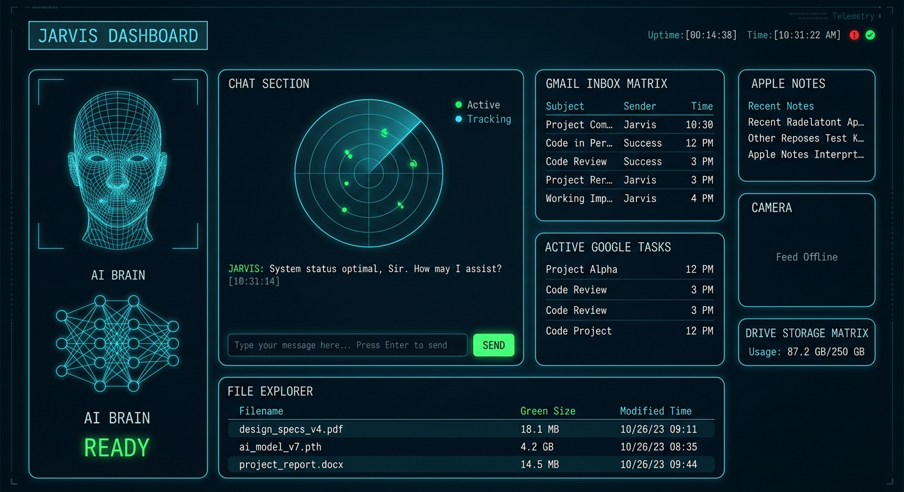

# UI Guide — Solar Core HUD + Web Dashboard

Jarvis V2 ships **two interfaces**, both in the same black-and-cyan Arc style:

1. **Arc Core HUD** (`gui/main_window.py`) — native Tkinter desktop app (default)
2. **Solar Web Dashboard** (`dashboard/`) — Spark-style browser dashboard via
   `python main.py --web` → `http://localhost:8765`

## Solar Web Dashboard (Spark-style)

Run `python main.py --web` and open **http://localhost:8765** (same machine) or
`http://<your-pc-ip>:8765` from a phone/tablet on the same network.

| Card | Contents |
| --- | --- |
| Hero | Canvas solar-core animation, assistant name, live stat tiles (memories, conversations, open tasks, grind minutes) |
| System Telemetry | Circular CPU / MEMORY / DISK gauges with color thresholds + power line |
| AI Console | Full chat with Jarvis; browser speaks replies (Web Speech API, deep-synthetic profile) with a TTS toggle |
| Tasks / Notes | Live from the productivity store |
| Memory Core | Facts Jarvis remembers (SQLite) |
| Roblox · Safe Mode | Session countdown, goals checklist, lifetime grind stats, quick buttons |
| Quick Actions | One-click commands (status, time, joke, screenshot, music…) |
| Bottom console | Fixed command bar with SEND / SPEAK / ROBLOX / GRIND |

**Under the hood:** `dashboard/server.py` uses only the Python standard library
(`http.server`) — `GET /api/state` returns the full snapshot (polled every 2 s) and
`POST /api/command` runs any command through the same Jarvis pipeline. Server-side
TTS is off by design: the browser speaks, so audio lands on the machine running
the browser.

## Desktop HUD: Solar Core

A "solar core": a glowing energy sphere at the center of the screen, wrapped in dense
orbiting particle rings and long radial scan beams. Everything else in the UI is kept
dark and minimal so the core reads as the engine of the assistant.

## Layout

| Region | What it contains |
| --- | --- |
| Top bar | `J.A.R.V.I.S V2` title, navigation (`HOME / AI / DASHBOARD`), live status (`AI GROQ · VOICE READY · CORE ACTIVE`) |
| HOME view | The animated solar core (particle orbits, radial beams, pulsing glow) plus a live telemetry line: `CPU MEM DSK PWR` |
| AI view | Chat transcript with the assistant (user messages soft cyan, JARVIS messages bright cyan, system notes muted) |
| DASHBOARD view | Telemetry bars with color thresholds, quick-action buttons, and the Roblox safe-mode panel |
| Bottom console | Slim command bar with placeholder `Type command or press Speak...` and buttons `SEND / SPEAK / ROBLOX / GRIND` |

## Behavior notes

- Every command runs on a background thread, so the UI never freezes while Jarvis
  thinks, speaks, or waits for speech recognition.
- `GRIND` is context-aware: it starts a 30-minute Roblox grind session when none is
  running, and shows session stats when one is active.
- `ROBLOX` jumps straight to Roblox stats.
- The Roblox panel always shows the live session state, lifetime minutes, and goals.
- Telemetry refreshes every 2 seconds via `psutil` (falls back to `N/A` if psutil is
  not installed).
- Window transparency and all colors are configurable under the `ui` section of
  `config/config.json`.

## Voice personas

The UI pairs with the persona system in `voice/voice_profiles.py`. The active profile
is `voice.voice_profile` in config:

| Profile | Character |
| --- | --- |
| `dark_synthetic` (default) | Slow, low, heavy, commanding — an original dark synthetic persona |
| `jarvis_classic` | Calm, polite butler-style assistant |
| `fast_operator` | Brisk mission-control pace |
| `gentle` | Softer, quieter late-night voice |

Switch at runtime with the `apply_profile()` helper, or edit config. Note: profiles
tune rate, volume, pitch, and preferred system voices — the exact sound ultimately
depends on the TTS voices installed on your operating system. The `dark_synthetic`
profile is an original persona, not a clone of any film character.
